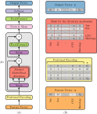

# A Deep Learning Approach for Overall Survival Prediction in Lung Cancer with Missing Values 

<p align="center" width="100%">

</p>

This document describes the implementation of *``A Deep Learning Approach for Overall Survival Prediction in Lung Cancer with Missing Values´´* in Pytorch. 
The proposed approach is an architecture specifically designed for survival analysis, with a focus on addressing missing values in 
clinical data without the need for any imputation strategy.

Our approach involves adapting the transformer's encoder architecture to tabular data, via a novel positional encoding 
for tabular features, and utilizing padding to mask any missing features within the attention module, enabling the model 
to ignore them effectively. 

# Usage

Here we provide a brief guide on how to use the code, comprising the label encoding, the model with the losses employed 
during training and the final metric to compute the performance.

The user can use a dataset of clinical features, but as an example we generate random data.
```python 
### DATA
n_samples = 100
n_features = 37
data = np.random.rand(n_samples, n_features)
```

To simulate a real case scenario, then we introduce some missing values in the data.
```python 
data[np.random.choice((0, 1), (n_samples, n_features), p=(0.8, 0.2)) == 1] = np.nan  # Introduce missing values
```

We also generate some random label to be used for the survival analysis. 
In particular, we generate a label that is a tuple with the event and its respective time.
```python
### LABELS
events = ("censored", "uncensored")
num_events = len(events) - 1  # The first event is the censored one, so we do not consider it
max_time = 72  # Maximum time to consider for the survival analysis
max_survival = 100  # Use this to generate labels, but then the analysis will consider only the time to max_time, setting those patients who survived longer than max_time to "censored"
labels = np.hstack( ( np.random.choice( events, (n_samples, 1)), np.random.rand(n_samples, 1)*max_survival ), dtype=object )
```

Given the labels, we can encode them in a format suitable for the survival analysis. 
More specifically, we encode the events with numbers starting from 0, which is related to the `censored` event, and we floor the time of the event, also setting those patients who survived longer than `max_time` to `max_time`.
In particular, in the latter case, we set the event to 0, which is the `censored` event.

```python
survival_label_function = np.vectorize(lambda label: label_to_survival( label, events, max_time ), signature="(n)->(m)")
survival_labels = survival_label_function(labels)
```

Afterward, we report some pieces of code to include in a training script and in the evaluation to test the model. 
We first define the parameters for the shared net, which is the transformer's encoder, 
and then the parameters for the cause specific subnets, which are the MLPs that will output the risk probabilities for each event in consideration, to instantiate the model.

```python
### MODEL
## OSTransformer (shared net)
emb_dim = n_features + 1
n_heads = emb_dim // 2
shared_net_params = dict(emb_dim=emb_dim, num_heads=n_heads, output_size=emb_dim)

## CustomMLP (CS subnets)
hidden_sizes = [400, 200]
cs_subnet_params = dict(hidden_sizes=hidden_sizes)

model = SurvivalWrapper(num_events=num_events, max_time=max_time, shared_net_params=shared_net_params, cs_subnets_params=cs_subnet_params)
```

Now we feed the data to the model and obtain the predictions, which are the risk probabilities for each event in consideration.
Note that the predictions for the `censored` event are not considered since the event is not observed, and the time is not relevant for the analysis.

```python
### OUTPUTS
## Forward pass
outputs = model(torch.from_numpy(data).float())

## Predictions
predictions = survival_prediction(outputs)
```

We can now compute the losses for the survival analysis, which are the survival log-likelihood loss and the survival ranking loss.
```python
### Survival Losses
loss = 0
criterion1 = SurvivalLogLikelihoodLoss(num_events=num_events, max_time=max_time)
loss += criterion1(outputs, torch.from_numpy(survival_labels).float().unsqueeze(dim=1))

criterion2 = SurvivalRankingLoss(num_events=num_events, max_time=max_time)
loss += criterion2(outputs, torch.from_numpy(survival_labels).float().unsqueeze(dim=1))
```

Finally, we can compute the performance of the model using the Ct-index, a time-dependent variant of the C-index. 
We perform the cumulative sum of the risk probabilities to obtain the cumulative incidence function (CIF) and then compute the Ct-index.
```python
### Performance
outputs = torch.cumsum(outputs, dim=-1)  # Compute the cumulative incidence function (CIF) cumulative summing the output probabilities
performance = Ct_index(survival_labels, outputs.detach().numpy(), num_events)
```


---
# Contact

For any questions, please contact [camillomaria.caruso@unicampus.it](mailto:camillomaria.caruso@unicampus.it) and [valerio.guarrasi@unicampus.it](mailto:valerio.guarrasi@unicampus.it).

---

# Citation

```bibtex
@article{CARUSO2024108308,
    title = {A Deep Learning Approach for Overall Survival Prediction in Lung Cancer with Missing Values},
    journal = {Computer Methods and Programs in Biomedicine},
    volume = {254},
    pages = {108308},
    year = {2024},
    issn = {0169-2607},
    doi = {https://doi.org/10.1016/j.cmpb.2024.108308},
    url = {https://www.sciencedirect.com/science/article/pii/S016926072400302X},
    author = {Camillo Maria Caruso and Valerio Guarrasi and Sara Ramella and Paolo Soda},
    keywords = {Survival analysis, Missing data, Precision medicine, Oncology},
}
```

